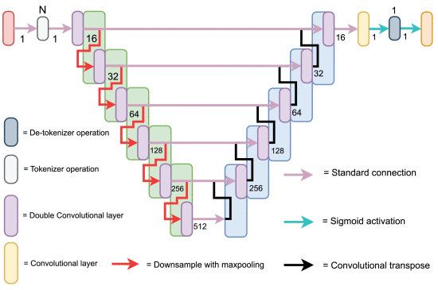
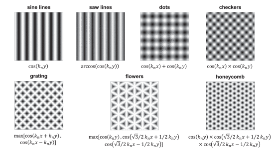
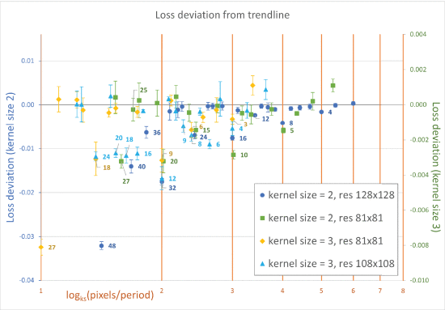

# Pattern Matters: Deep Learning 3D Profilometry

[](https://ieeexplore.ieee.org/document/11075725)
[](LICENSE)
[](https://www.python.org/downloads/)
[](https://github.com/InViLabUAntwerp)

**Official implementation of "Pattern Matters: The Impact of Projection Patterns on Deep Learning 3D Profilometry"**

This repository contains tools for generating simulated datasets and training machine learning models to investigate how different projection patterns affect deep learning-based 3D surface reconstruction.

---

## 📄 Citation

If you use this code in your research, please cite our paper:

```bibtex
@ARTICLE{11075725,
  author={Evans, Rhys G. and Bordo, Stef and Dirckx, Joris J. J. and Van der Jeught, Sam},
  journal={IEEE Transactions on Instrumentation and Measurement}, 
  title={Pattern Matters: The Impact of Projection Patterns on Deep Learning 3-D Profilometry}, 
  year={2025},
  volume={74},
  number={},
  pages={1-18},
  keywords={Noise;Training;Neural networks;Generators;Vectors;Deep learning;Three-dimensional displays;Surface treatment;Standards;Speckle;3-D imaging and sensing;artificial intelligence;machine learning;profilometry;structured light},
  doi={10.1109/TIM.2025.3587365}}

```

**Paper Link:** [IEEE Xplore](https://ieeexplore.ieee.org/document/11075725)

---

## 🔬 Overview

This research investigates the influence of different projection patterns on the performance of deep learning models for 3D surface profilometry.
The study provides insights into how pattern selection affects reconstruction accuracy and model training dynamics.
Predominant research was performed on synthetic surface data (Gaussian and Perlin noise) and benchmarked on a physical dataset to determine if the period findings still transfer to real -less ideal- data.

### Key Findings

- **Pattern Symmetry and Repetition**: Saw-tooth and sinusoidal outperform non-conventional patterns, yet all projection patterns have a high performance
- **Optimal Period Count**: $\log_{kernel size}(pixels/period amount)$ resulting in a whole number is the optimal period count for the image resolution
- **Impact of Image Size and Ratio**: 1:1 height is still a necessity, even with the pattern repetition
- **Pooling Operations**: Average-pooling increases performance in comparison to max-pooling

---

## 🖼️ Visual Examples

### Network Architecture
  
*Our Token U-Net architecture for 3D surface reconstruction from projection patterns.*

### Projection Patterns
  
*Different projection patterns used in our study and their impact on reconstruction quality.*

### Results
  
*Quantitative comparison of reconstruction performance across different pattern types and optimizers.*

---

## 🚀 Quick Start

### Prerequisites

- Python 3.9 or higher
- CUDA-compatible GPU (recommended for training)

### Installation

```bash
# Clone the repository
git clone https://github.com/RhysEvan/Pattern-Matters.git
cd Pattern-Matters

# Install required packages
pip install -r requirements.txt
```

### Basic Usage

#### 1. Generate Training Data

**Perlin Surface (Recommended):**
```bash
# Navigate to Perlin surface generation folder
cd Data_Generation__Perlin_surface

# Step A: Generate labels
python A_generate_labels.py

# Step B: Project patterns onto surface (creates input data)
python B_project_patterns.py

# Step C: Generate denominator/nominator specific data
python C_generate_dn_data.py
```

**Gaussian Surface:**
```bash
# Navigate to Gaussian surface generation folder
cd Data_Generation__Gaussian_surface

# Step A: Generate labels
python A_generate_labels.py

# Step B: Project patterns onto surface
python B_project_patterns.py
```

#### 2. Train the Model

**Using SGD Optimizer:**
```bash
cd Network_SGD
python training_script.py
```

**Using ADAM Optimizer:**
```bash
cd Network_ADAM
python training_script.py
```

**Note:** Ensure hyperparameters are configured at the bottom of the training scripts before execution.

---

## 📁 Repository Structure

```
Pattern-Matters/
├── Data_Generation__Gaussian_surface/
│   ├── A_*.py          # Label generation
│   └── B_*.py          # Pattern projection
│
├── Data_Generation__Perlin_surface/
│   ├── A_*.py          # Label generation
│   ├── B_*.py          # Pattern projection
│   └── C_*.py          # Denominator/Nominator data
│
├── Network_SGD/
│   ├── model/          # SGD model architecture
│   └── training_*.py   # SGD training script
│
├── Network_ADAM/
│   ├── model/          # ADAM model architecture
│   └── training_*.py   # ADAM training script
│
├── requirements.txt    # Python dependencies
├── LICENSE            # MIT License
└── README.md          # This file
```

### Workflow Overview

1. **Data Generation**: Create synthetic 3D surface labels and apply projection patterns
2. **Network Training**: Train deep learning models using different optimizers
3. **Evaluation**: Compare reconstruction quality across different pattern types

---

## 🔧 Detailed Usage

### Data Generation

Both Gaussian and Perlin surface generators create paired datasets:
- **Labels**: Ground truth 3D surface height maps
- **Inputs**: Pattern-projected images for network training

Execute files in alphabetical order (A → B → C) to ensure proper data dependencies.

#### File Naming Convention
- `A_*.py`: Label generation scripts
- `B_*.py`: Pattern projection scripts  
- `C_*.py`: Additional specialized data generation (Perlin only)

### Network Training

Each optimizer folder contains:
- **model/**: Network architecture definitions and utilities
- **training_*.py**: Main training loop with configurable hyperparameters

**Important**: Review and adjust hyperparameters in the training script before running:
- Learning rate
- Batch size
- Number of epochs
- Data paths

## 🛠️ Dependencies

See `requirements.txt` for a complete list. Main dependencies include:
- PyTorch
- NumPy
- Matplotlib
- OpenCV
- SciPy

---

## 🤝 Contributing

Contributions are welcome! If you have suggestions or improvements:

1. Fork the repository
2. Create a feature branch (`git checkout -b feature/YourFeature`)
3. Commit your changes (`git commit -m 'Add YourFeature'`)
4. Push to the branch (`git push origin feature/YourFeature`)
5. Open a Pull Request

For major changes, please open an issue first to discuss proposed changes.

---

## 📧 Contact

**Author**: Rhys Gustaf Evans  
**Email**: rhys.evans@uantwerpen.be  
**Lab**: [InViLab - Imaging & Vision Lab](https://invilab.be)  
**Institution**: University of Antwerp

For questions about the code or paper, please:
- Open an issue on GitHub
- Contact the authors via email
- Visit the [InViLab GitHub organization](https://github.com/InViLabUAntwerp)

---

## 🙏 Acknowledgments

This research was conducted at the **InViLab (Imaging & Vision Lab)** at the University of Antwerp.

**InViLab Resources:**
- 🔗 [InViLab GitHub Organization](https://github.com/InViLabUAntwerp)
---

## 📜 License

This project is licensed under the MIT License - see the [LICENSE](LICENSE) file for details.

```
Copyright (c) 2024 Rhys Gustaf Evans, InViLab - University of Antwerp

Permission is hereby granted, free of charge, to any person obtaining a copy
of this software and associated documentation files (the "Software"), to deal
in the Software without restriction, including without limitation the rights
to use, copy, modify, merge, publish, distribute, sublicense, and/or sell
copies of the Software, and to permit persons to whom the Software is
furnished to do so, subject to the following conditions:

The above copyright notice and this permission notice shall be included in all
copies or substantial portions of the Software.
```

---

## 🔖 Additional Resources

- **Paper**: [Pattern Matters: The Impact of Projection Patterns on Deep Learning 3D Profilometry](https://ieeexplore.ieee.org/document/11075725)
- **InViLab**: [University of Antwerp Imaging & Vision Lab](https://invilab.be)
- **Related Work**: [Other InViLab publications and code repositories](https://github.com/InViLabUAntwerp?tab=repositories)

---

**⭐ If you find this work useful, please consider starring the repository and citing our paper!**